# Proof: PR Review Creation Flow

```mermaid
flowchart TD
    A[/"User runs proof poll"/]:::user --> B{"Single PR\nor batch?"}:::decision

    B -->|"proof poll owner/repo#123"| D[Resolve tokens via gh auth]:::internal
    B -->|"proof poll (no args)"| C[GitHub Search API\nreview-requested:@me\nteam-review-requested]:::github

    C --> E{"Interactive?\n(TTY + !batch)"}:::decision
    E -->|Yes| F[Show PR list with status\nUser selects PRs]:::user
    E -->|No| D
    F --> D

    D --> G{"Pending review\nalready exists?"}:::decision
    G -->|"Yes"| H[Skip — already reviewed]:::skip
    G -->|"--re-review"| I[Delete existing review]:::filter
    G -->|"No"| J

    I --> J[Fetch PR context\ndiff + files + metadata]:::github

    J --> K{"Max files or\nmax_diff_bytes\nexceeded?"}:::decision
    K -->|Yes| L[Skip — PR too large]:::skip
    K -->|No| M

    M[Apply .proofignore filters\nglobal + repo-level]:::filter --> N

    N[Fetch repo instructions\n.github/copilot-instructions.md\n.github/instructions/*.md\n.proof.yaml / AGENTS.md]:::github --> O

    O[Build system prompt\nbase + repo instructions\n+ user instructions + profile]:::internal --> P

    P[Start Copilot SDK session\nfresh session per PR\n30s timeout on creation]:::ai --> Q

    Q[Send diff + prompt\nCapture assistant.message\n+ assistant.usage events\n3min timeout]:::ai --> R

    R{"Timeout?"}:::decision
    R -->|Yes| S[Retry once automatically]:::ai
    R -->|No| T
    S -->|Still fails| U[Error with actionable message\nmodel, files, diff size shown]:::skip
    S -->|Success| T

    T[Parse JSON response\nsummary + verdict + comments]:::internal --> V

    V[Filter out-of-hunk\nline numbers\ndrop invalid, note in body]:::filter --> W

    W[GitHub API: Create\nPENDING review\nno event = stays draft\nvisible only to reviewer]:::github --> X

    X[Store locally\npending.json — tracking\nreviews.jsonl — history + usage\nlearning.jsonl — curation delta]:::internal --> Y

    Y[/"Done! User visits GitHub\nto curate and submit\n🔒 Human-in-the-loop"/]:::user

    classDef user fill:#a5d8ff,stroke:#1e1e1e,stroke-width:2px,color:#000
    classDef github fill:#b2f2bb,stroke:#1e1e1e,stroke-width:2px,color:#000
    classDef internal fill:#d0bfff,stroke:#1e1e1e,stroke-width:2px,color:#000
    classDef filter fill:#ffd8a8,stroke:#1e1e1e,stroke-width:2px,color:#000
    classDef ai fill:#ffc9c9,stroke:#e03131,stroke-width:2px,color:#000
    classDef decision fill:#ffec99,stroke:#1e1e1e,stroke-width:2px,color:#000
    classDef skip fill:#f1f3f5,stroke:#868e96,stroke-width:1px,color:#868e96
```

## Legend

| Color | Meaning |
|-------|---------|
| 🔵 Blue | User interaction |
| 🟢 Green | GitHub API call |
| 🟣 Purple | Internal processing |
| 🟠 Orange | Filtering / validation |
| 🔴 Red | AI / Copilot SDK |
| 🟡 Yellow | Decision point |
| ⚪ Gray | Skip / exit path |

## Key Design Principles

1. **Human-in-the-loop**: The CLI never publishes reviews. Users must visit GitHub to submit.
2. **Fresh session per PR**: Each review gets its own Copilot session — failures don't cascade.
3. **Retry on timeout**: One automatic retry before giving up, with actionable error messages.
4. **Layered instructions**: Base prompt → repo instructions → user config → profile, composed in order.
5. **Defensive filtering**: Invalid line numbers are caught before hitting the GitHub API.
